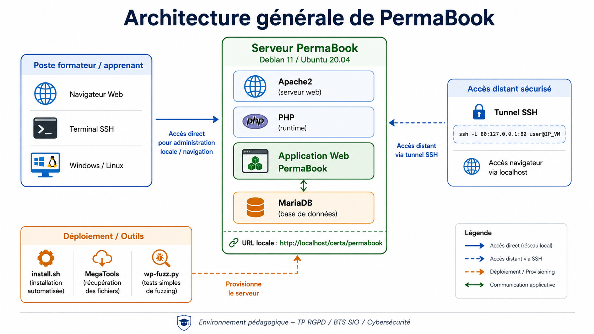

# 📚 PermaBook


---

## 🏗️ Architecture générale

<p align="center">
  
</p>

<p align="center">
  <em>Architecture générale de l’environnement pédagogique PermaBook</em>
</p>

---

## 🧭 Présentation

**PermaBook** est une appliance Web destinée à la mise en place rapide d’un environnement pédagogique pour des travaux pratiques autour du **RGPD**, de la protection des données et de la cybersécurité.

Ce dépôt permet de déployer un environnement Web complet sur une machine Debian ou Ubuntu afin de disposer d’un support exploitable en TP, notamment dans un contexte **BTS SIO**, **Bloc 03**, **cybersécurité** et **protection des données personnelles**.

Le projet fournit :

* ⚙️ un script d’installation automatisée ;
* 🌐 une application Web PermaBook ;
* 🗄️ une base de données associée ;
* 🧪 un outil de fuzzing simple pour tester les identifiants de pages ;
* 📄 une documentation PDF complémentaire pour guider l’installation.

---

## 🎯 Objectifs pédagogiques

Ce projet a été conçu pour permettre aux apprenants de :

* 🐧 installer une application Web dans un environnement Linux ;
* 🧱 manipuler une pile Web classique : Apache, PHP, MariaDB ;
* 🔐 comprendre les notions de données personnelles dans un contexte applicatif ;
* ⚠️ analyser les risques liés à une application Web ;
* 🔎 réaliser des tests simples de découverte de contenus ;
* 🛡️ aborder les bonnes pratiques de sécurisation et d’administration système ;
* 🔗 utiliser un tunnel SSH pour exposer temporairement une application locale.

---

## 🚀 Fonctionnalités principales

* ⚙️ Déploiement automatisé de PermaBook.
* 📦 Installation des dépendances système nécessaires.
* 🌐 Configuration d’un serveur Web Apache.
* 🗄️ Mise en place d’une base de données MariaDB.
* 📥 Import automatique de la base PermaBook.
* 💻 Accès local à l’application depuis la VM.
* 🔗 Accès distant possible via tunnel SSH.
* 🧪 Script Python de fuzzing pour tester des paramètres d’URL.

---

## 🧱 Architecture technique

L’environnement repose sur les composants suivants :

| Picto | Élément                         | Rôle                                    |
| ----- | ------------------------------- | --------------------------------------- |
| 🐧    | Debian 11 / Ubuntu 20.04 Server | Système d’exploitation cible            |
| 🌐    | Apache2                         | Serveur Web                             |
| 🧩    | PHP                             | Exécution de l’application Web          |
| 🗄️   | MariaDB                         | Base de données                         |
| 📥    | MegaTools                       | Téléchargement de l’archive applicative |
| 🐍    | Python 3                        | Exécution du script de fuzzing          |
| 🔎    | lxml / requests                 | Analyse HTML et requêtes HTTP           |

---

## 📁 Structure du dépôt

```text
permabook/
├── README.md
├── install.sh
├── wp-fuzz.py
├── TP_install_permabook.pdf
└── architecture-generale-permabook.png
```

| Picto | Fichier                                      | Description                                        |
| ----- | -------------------------------------------- | -------------------------------------------------- |
| 📘    | `README.md`                                  | Documentation principale du dépôt                  |
| ⚙️    | `install.sh`                                 | Script d’installation automatisée de PermaBook     |
| 🐍    | `wp-fuzz.py`                                 | Script Python de fuzzing des identifiants de pages |
| 📄    | `TP_install_permabook.pdf`                   | Documentation pédagogique complémentaire           |
| 🖼️   | `assets/architecture-generale-permabook.png` | Schéma d’architecture générale du lab              |

---

## ✅ Prérequis

### 🖥️ Système recommandé

* Debian 11 Server
* Ubuntu 20.04 Server

### 📦 Paquets nécessaires

Avant l’installation, vérifier que les paquets de base suivants sont disponibles :

```bash
sudo apt update
sudo apt install -y git curl python3 python3-lxml megatools
```

### 🔑 Accès nécessaires

L’installation nécessite :

* un accès SSH à la VM ;
* un compte disposant des droits administrateur ;
* une connexion Internet ;
* un accès `root` ou `sudo`.

---

## ⚡ Installation rapide

### 1. 🔐 Connexion à la VM

Depuis votre machine d’administration :

```bash
ssh user@<IP_DE_LA_VM>
```

Exemple :

```bash
ssh user@192.168.1.50
```

---

### 2. 👑 Passage en mode administrateur

```bash
su -
```

ou, selon votre configuration :

```bash
sudo -i
```

---

### 3. 📦 Installation des dépendances

```bash
apt update -y
apt install -y git curl python3 python3-lxml megatools
```

---

### 4. ⚙️ Exécution du script d’installation

Le script installe et configure les composants nécessaires :

* 🌐 Apache2 ;
* 🗄️ MariaDB Server ;
* 🧩 PHP et ses modules ;
* 📚 l’application PermaBook ;
* 🗃️ la base de données associée.

---

## 🧨 Installation en une seule commande

Pour un environnement de TP jetable, il est possible d’utiliser la commande suivante :

```bash
curl https://raw.githubusercontent.com/sbeteta42/permabook/main/install.sh | sh -
```

> ⚠️ **Attention :** cette méthode exécute directement un script distant. Elle est pratique pour un TP rapide, mais il est recommandé de consulter le script avant exécution dans un contexte professionnel.

---

## 🌐 Accès à PermaBook

Par défaut, PermaBook est accessible localement depuis la VM à l’adresse suivante :

```text
http://localhost/certa/permabook
```

Si vous êtes connecté directement sur la VM avec une interface graphique, ouvrez simplement cette adresse dans le navigateur.

---

## 🔗 Accès depuis une machine externe

PermaBook est conçu pour être accessible correctement depuis `localhost`. Pour l’utiliser depuis une machine externe, il faut créer un tunnel SSH.

### 🐧 Depuis GNU/Linux

Depuis votre machine personnelle, exécuter :

```bash
sudo ssh -L 80:127.0.0.1:80 user@<IP_DE_LA_VM>
```

Exemple :

```bash
sudo ssh -L 80:127.0.0.1:80 user@192.168.1.50
```

Ensuite, ouvrir dans le navigateur :

```text
http://localhost/certa/permabook
```

---

### 🪟 Depuis Microsoft Windows

Ouvrir `cmd` ou PowerShell en mode administrateur, puis exécuter :

```powershell
ssh -L 80:127.0.0.1:80 user@<IP_DE_LA_VM>
```

Exemple :

```powershell
ssh -L 80:127.0.0.1:80 user@192.168.1.50
```

Puis ouvrir dans le navigateur :

```text
http://localhost/certa/permabook
```

> ℹ️ Ne pas fermer la connexion SSH pendant le TP. Si le tunnel SSH est fermé, l’accès depuis la machine externe ne fonctionnera plus.

---

## 🧪 Fuzzing des pages

Le dépôt fournit un script Python permettant de tester des identifiants de pages sur une URL donnée.

### 📦 Installation des dépendances Python

```bash
apt install -y python3 python3-lxml
```

Selon votre environnement, il peut être nécessaire d’installer également `requests` :

```bash
apt install -y python3-requests
```

---

### ▶️ Utilisation

Syntaxe :

```bash
python3 wp-fuzz.py <URL> <PARAMETRE> <NOMBRE>
```

Exemple :

```bash
python3 wp-fuzz.py http://localhost/certa/permabook page_id 100
```

Cette commande teste les valeurs de `page_id` de `0` à `99` et affiche les pages qui répondent correctement.

---

## 🧑‍🏫 Exemple de scénario pédagogique

### 🧩 Contexte

Vous êtes technicien cybersécurité dans un établissement de formation.
Votre responsable vous demande d’installer une application Web pédagogique permettant d’étudier les problématiques liées aux données personnelles.

### 📌 Travail demandé

1. 🐧 Installer une VM Debian ou Ubuntu.
2. ⚙️ Déployer PermaBook.
3. 🌐 Vérifier l’accès local.
4. 🔗 Mettre en place un tunnel SSH.
5. 💻 Accéder à l’application depuis votre poste.
6. 🔎 Identifier les pages accessibles.
7. 🧪 Réaliser un test de fuzzing.
8. 📝 Documenter les résultats.
9. 🛡️ Proposer des mesures de sécurisation.

---

## 🛡️ Bonnes pratiques de sécurité

Ce projet est prévu pour un usage pédagogique en environnement contrôlé.

Il est recommandé de :

* 🧪 utiliser une VM dédiée au TP ;
* 🚫 ne pas exposer directement l’application sur Internet ;
* 🔐 limiter l’accès réseau à l’environnement de formation ;
* 🔑 modifier les identifiants par défaut si l’environnement est conservé ;
* 🧹 supprimer les fichiers temporaires après installation ;
* 📁 vérifier les permissions du répertoire Web ;
* 🔥 désactiver ou filtrer les accès non nécessaires ;
* 📝 documenter les actions réalisées par les apprenants.

---

## 🧰 Dépannage

### ❌ Apache ne démarre pas

Vérifier l’état du service :

```bash
systemctl status apache2
```

Redémarrer Apache :

```bash
systemctl restart apache2
```

Vérifier que le port 80 est libre :

```bash
ss -tulpen | grep :80
```

---

### ❌ MariaDB ne démarre pas

Vérifier l’état du service :

```bash
systemctl status mariadb
```

Redémarrer MariaDB :

```bash
systemctl restart mariadb
```

---

### ❌ La page Web ne s’affiche pas

Vérifier la présence des fichiers :

```bash
ls -lah /var/www/html/certa/permabook
```

Vérifier les droits :

```bash
chown -R www-data:www-data /var/www/html/certa/permabook
```

Redémarrer Apache :

```bash
systemctl restart apache2
```

---

### ❌ Le tunnel SSH ne fonctionne pas

Vérifier que la connexion SSH reste ouverte.

Vérifier que le port local 80 n’est pas déjà utilisé :

```bash
ss -tulpen | grep :80
```

Essayer avec un autre port local :

```bash
ssh -L 8080:127.0.0.1:80 user@<IP_DE_LA_VM>
```

Puis accéder à :

```text
http://localhost:8080/certa/permabook
```

---

## 📄 Documentation complémentaire

Une documentation plus complète est disponible dans le fichier :

```text
TP_install_permabook.pdf
```

Ce document peut être utilisé comme support de TP, fiche d’installation ou guide formateur.

---

## 🧱 Améliorations possibles

Pistes d’évolution du projet :

* 🛠️ ajout d’un script d’installation plus robuste avec gestion des erreurs ;
* 🧹 ajout d’un mode désinstallation ;
* ⚙️ ajout d’un fichier `.env` pour la configuration ;
* 🐳 ajout d’une procédure Docker ;
* 🤖 ajout d’un playbook Ansible ;
* 📘 ajout d’une documentation apprenant / formateur séparée ;
* 🧾 ajout d’un barème d’évaluation ;
* 🖼️ ajout de captures d’écran ;
* 🛡️ ajout d’un guide de durcissement sécurité ;
* ⚖️ ajout d’une licence explicite.

---

## 🎓 Usage prévu

Ce dépôt est destiné à un usage :

* 🧑‍🏫 pédagogique ;
* 🧪 laboratoire ;
* 🎓 formation BTS SIO ;
* 🔐 sensibilisation RGPD ;
* 🛡️ cybersécurité défensive ;
* 🐧 administration système Linux ;
* 📚 travaux pratiques encadrés.

Il n’est pas destiné à être déployé tel quel en production.

---

## 🤝 Contribution

Les contributions sont les bienvenues pour améliorer :

* 📄 la documentation ;
* ⚙️ la robustesse du script d’installation ;
* 🐧 la compatibilité avec des versions plus récentes de Debian ou Ubuntu ;
* 🎓 les supports pédagogiques ;
* 🧪 les scénarios de TP ;
* 🛡️ les bonnes pratiques de sécurité.

Proposition de workflow :

```bash
git clone https://github.com/sbeteta42/permabook.git
cd permabook
git checkout -b feature/amelioration
```

Après modification :

```bash
git add .
git commit -m "Amélioration de la documentation"
git push origin feature/amelioration
```

Puis ouvrir une Pull Request.

---

## 👤 Auteur

Projet maintenu par :

**Stéphane BETETA**
Formateur / Ingénieur en informatique et cybersécurité

GitHub : [sbeteta42](https://github.com/sbeteta42)

---

## ⚖️ Licence

Aucune licence explicite n’est actuellement fournie dans le dépôt.

Avant toute réutilisation, redistribution ou modification publique, il est recommandé d’ajouter un fichier `LICENSE`.

Exemples possibles :

* MIT License ;
* GPLv3 ;
* Creative Commons pour les supports pédagogiques ;
* licence propriétaire pour un usage interne de formation.

---

## ⚠️ Avertissement

Ce projet est fourni à des fins pédagogiques.

Les tests, scripts et manipulations doivent être réalisés uniquement dans un environnement autorisé, isolé et maîtrisé. Toute utilisation sur un système tiers sans autorisation est interdite.
